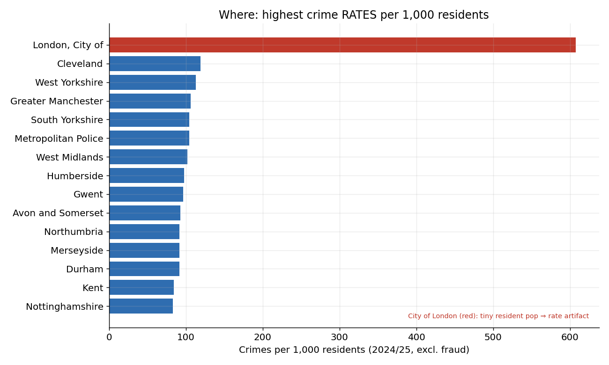
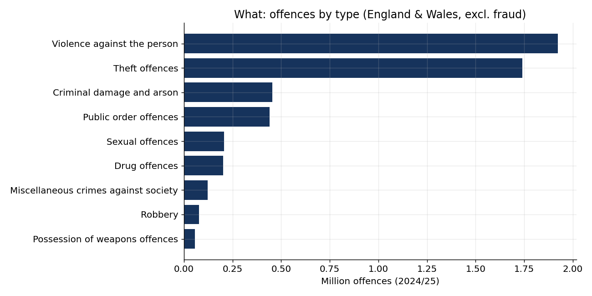
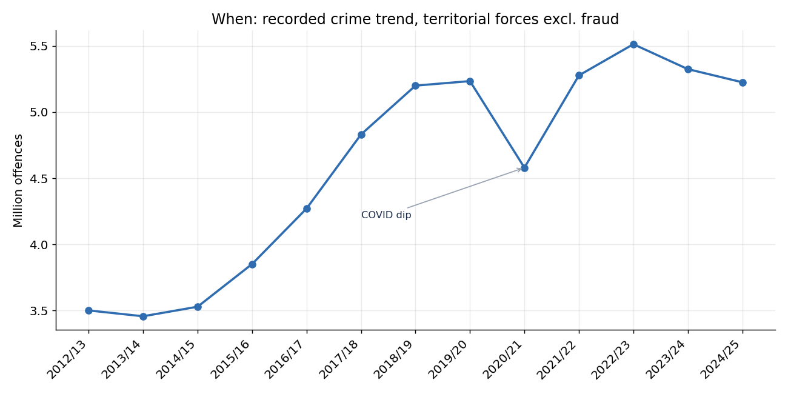
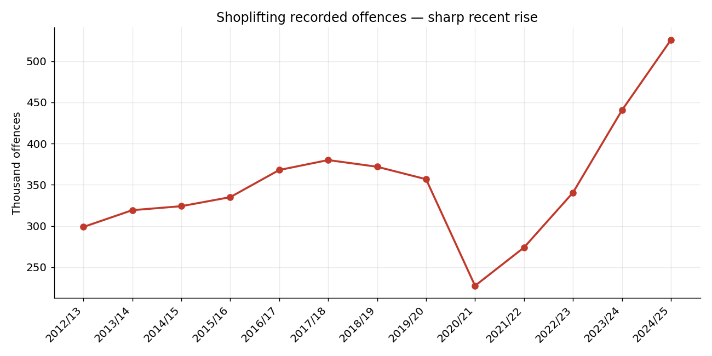
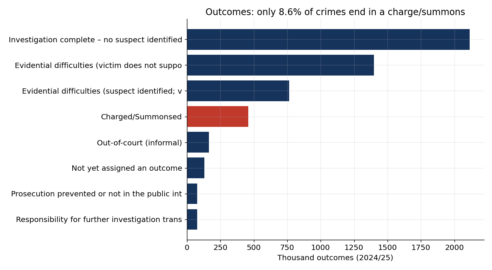
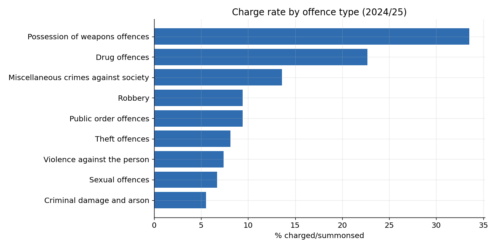
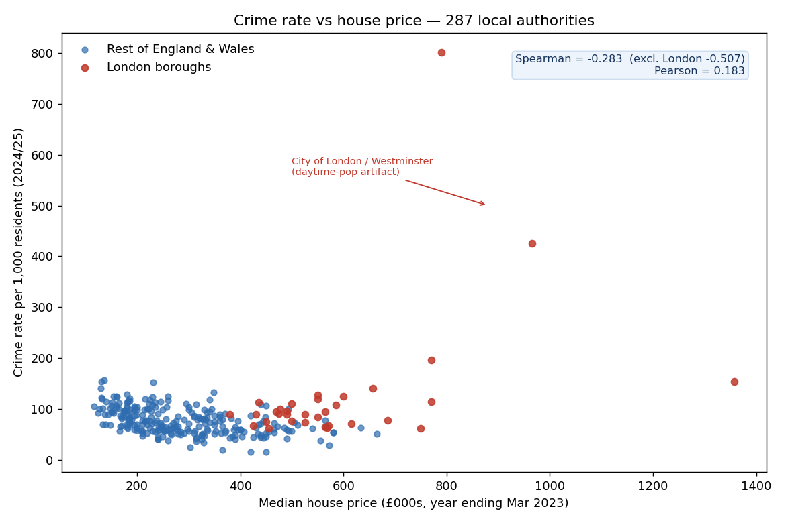

# UK Crime — Where, What & How it's resolved

End-to-end data-analytics case study on **6.6 million** police-recorded offences in **England & Wales** (year ending March 2025): where crime concentrates **per head of population**, what types dominate, how the trend has moved, and how few crimes end in a charge — all from **official Home Office and ONS open data**.

**Author:** Robert Maszkiewski · Aspiring Data Analyst (Google Data Analytics certified)
**Live dashboard:** https://rmportfolio.co.uk/case-studies/uk-crime.html
**Kaggle notebook:** https://www.kaggle.com/code/robertmaszkiewski/uk-crime
**Contact:** [LinkedIn](https://www.linkedin.com/in/robert-maszkiewski) · robertmaszkiewski@gmail.com

---

## TL;DR — what this project shows

- **Raw counts mislead.** London records the most crime because it has the most people. **Per 1,000 residents**, the highest rates are in **Cleveland, West Yorkshire and Greater Manchester**.
- **Two types dominate:** **violence (37%)** and **theft (33%)** are two-thirds of recorded crime.
- **Shoplifting is surging** — up **~54% in two years** (340k → 526k offences).
- **Most crimes go unresolved:** only **8.6%** end in a charge or summons; **~40%** are closed with no suspect identified.
- The analytical backbone is **honesty about the data**: recorded ≠ actual crime, fraud is recorded centrally, and per-capita rates need the right denominator (the City of London "607 per 1,000" is a resident-population artifact, flagged not headlined).

---

## The questions (Ask)

1. **Where** is crime highest **per head of population** (not just raw totals)?
2. **What** kinds of crime drive the totals?
3. **When** — which way has the trend moved?
4. **How** are crimes resolved — what share end in a charge?

> **A note on a question I deliberately did _not_ answer.** A common ask is "which nationality commits the most crime?" UK open crime data contains **no offender nationality or ethnicity** — it records *incidents* (location, type, outcome), not offenders. The nearest official data (stop-and-search ethnicity, MoJ criminal-justice statistics) measures *contact with the justice system*, not "who commits crime", and is meaningless without per-capita rates and confounder control. So this study makes **no** such claim — it would not be supportable from the data.

## The data (Prepare)

All sources are **© Crown copyright, Open Government Licence v3.0**:

| Source | Used for |
|---|---|
| Home Office — [Police recorded crime open data, Police Force Area tables](https://www.gov.uk/government/statistical-data-sets/police-recorded-crime-and-outcomes-open-data-tables) | Counts by force × quarter × offence (2012/13–2025/26) |
| Home Office — [Outcomes open data (year ending March 2025)](https://www.gov.uk/government/statistical-data-sets/police-recorded-crime-and-outcomes-open-data-tables) | How recorded crimes are resolved |
| ONS — [Population estimates for police force areas (mid-1991 to mid-2024)](https://www.ons.gov.uk/peoplepopulationandcommunity/populationandmigration/populationestimates/adhocs/3194populationestimatesforpoliceforceareasinenglandandwalesbysingleyearofageandsexmid1991tomid2024) | Per-capita rates (resident population) |
| ONS Open Geography — [Police Force Areas (Dec 2023) Boundaries EW BUC](https://geoportal.statistics.gov.uk/) | Choropleth map |

**Scope:** England & Wales, 43 territorial forces. Year ending **March 2025** is the headline (last *complete* financial year; 2025/26 was only part-loaded at time of analysis).

## Method & honest caveats (Process)

Each is a deliberate, documented decision:

1. **Recorded crime ≠ actual crime.** These are offences *recorded by police* — sensitive to reporting and recording practices. Part of the 2013–2019 rise reflects improved recording, not only more crime (the Crime Survey for England & Wales measures victimisation separately).
2. **Fraud is excluded from per-area rates.** Fraud is recorded centrally by Action Fraud, not by territorial forces, so it would distort geography. It's reported separately (~1.28M).
3. **Six "forces" are not geographic** (Action Fraud, CIFAS, UK Finance, Financial Fraud Action UK, British Transport Police) and are excluded from the 43-force geographic analysis.
4. **Per-capita uses ONS mid-2024 resident population** — appropriate, but it mis-states commuter/tourist hubs. The **City of London** (≈9k residents) shows ~607/1,000 purely as a denominator artifact and is flagged, never headlined.
5. **Latest *complete* year.** 2025/26 had only 3 of 4 quarters loaded, so the headline uses 2024/25 — checking this stops you publishing a half-year as a full one.

**Reconciliation (year ending March 2025):** 5.23M (territorial, excl. fraud) + 1.28M (fraud) + ~0.08M (British Transport Police) = **6.59M** total recorded.

## Findings (Analyze & Share)

**Where — crime rate per 1,000 residents (per capita reorders the league table).**


**What — violence and theft dominate.**


**When — the trend, and a sharp recent rise in shoplifting.**



**How it's resolved — only 8.6% of crimes end in a charge.**



## Deep-dive: do cheaper areas have more crime?

Joining crime to **median house price** across **287 local authorities** (92% of recorded crime) — and a lesson in not trusting one correlation coefficient.



- The naive **Pearson r = +0.18** is *misleading*: the City of London and Westminster have extreme prices **and** extreme (daytime-driven) crime rates, pulling the line up.
- Rank-based and with London removed, the real pattern is **negative — Spearman −0.28 overall, −0.51 excluding London**: more crime tends to go with **cheaper** housing (Middlesbrough, Blackpool, Hartlepool = high crime, low price; Kent commuter towns and Derbyshire Dales = low crime, higher price).
- **Correlation isn't causation** — deprivation, urban density and footfall plausibly drive both. This is an *ecological* (area-level) relationship and says nothing about individuals.

Data: Home Office CSP recorded crime 2024/25 (excl. fraud) · ONS HPSSA median price paid (to Mar 2023) · ONS mid-2022 population · ONS LAD (Dec 2022) boundaries. ~70 areas excluded due to local-government reorganisation between data vintages.

## Tools

Python · pandas · numpy · python-calamine (fast ODS/XLSX) · matplotlib · GeoJSON / Leaflet (dashboard) · Git

## Repository structure

```
uk-crime-case-study/
├── notebooks/
│   └── uk_crime_case_study.ipynb     # full end-to-end analysis (runs on Kaggle with Internet on)
├── analysis/                          # aggregated outputs powering the dashboard (CSV + crime_data.json)
├── data/
│   ├── clean/                         # cleaned tables (Parquet) + PFA population
│   └── geo/                           # PFA boundaries (GeoJSON) + geography reference
├── reports/figures/                   # charts (PNG)
├── docs/01_method.md                  # method & caveats
└── README.md
```

## Reproduce it

1. Open `notebooks/uk_crime_case_study.ipynb` (Kaggle: turn **Internet ON**, or add the source files as a dataset).
2. Run all cells — the loader downloads the official Home Office/ONS files and reproduces every figure and number above.

---

*Part of my data-analytics portfolio → [rmportfolio.co.uk](https://rmportfolio.co.uk). Data © Crown copyright, Open Government Licence v3.0.*
